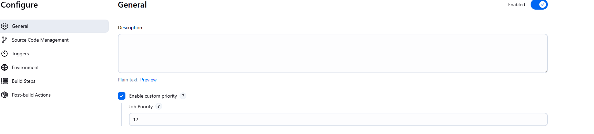
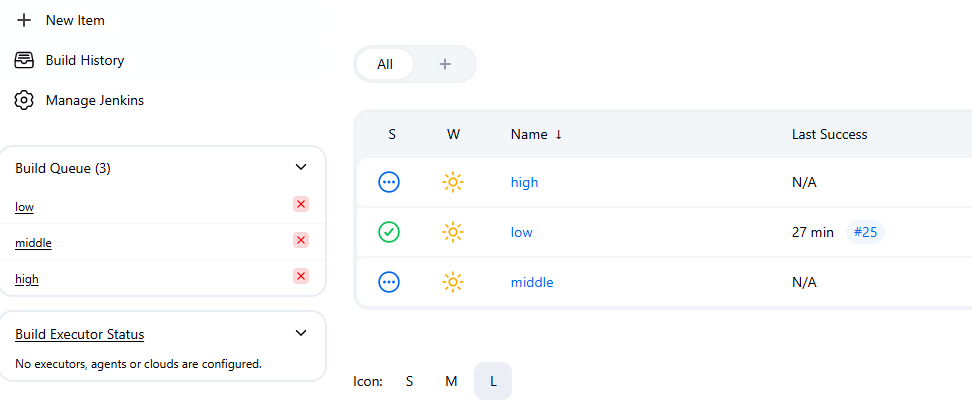

# Simple Priority Sorter Plugin

## Introduction

This plugin change the default Jenkins queue sorter to sort by priority that every job can define.

If jobs doesn't have priority defined, the default priority is 10.

Jobs with lower priority number are added first in the executor queue.

## Getting started

For all jobs you can configure the priority on the "Enable custom priority"



For pipeline it can be set on the pipeline script

```groovy
properties([basicJobPriority(priority: 10)])
```

On declarative options

```groovy
options {
    basicJobPriority priority: 10
}
```

Jobs with lower priority number are executed first.

Considering 3 jobs with priority configured as:

- high: 2
- medium: 7
- low: 12

And all executors are taken, the queue will look like this whatever the order the jobs are added to the queue:

1. low
2. medium
3. high



## LICENSE

Licensed under MIT, see [LICENSE](LICENSE.md)

